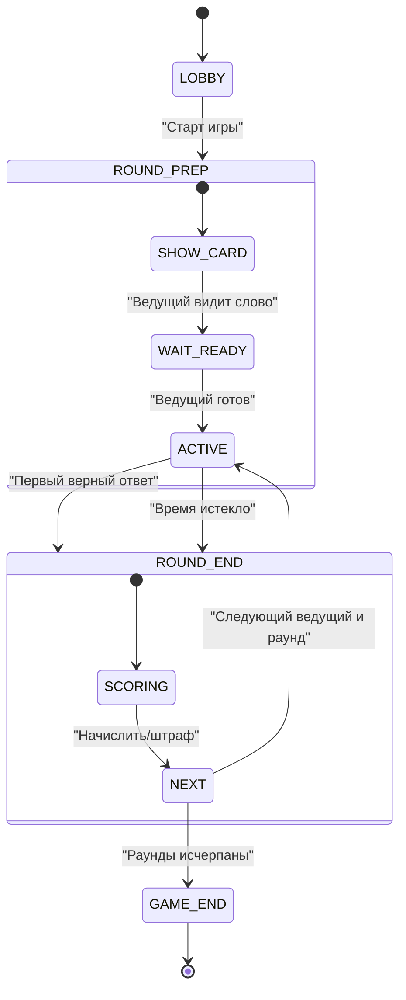

## Игра «Крокодил» — Дизайн-документ

### Оглавление
1. Цель и краткое описание
2. Игровой процесс (геймплей)
3. Роли и термины
4. Жизненный цикл: Лобби → Раунды → Завершение
5. Очки и тай-брейки
6. Валидация ответов
7. Управление очередью ходов
8. Сетевые события (мультиплеер)
9. Карточка слова (UI)
10. Конфигурация
11. Диаграммы (поток и состояния)
12. Пограничные случаи
13. Механика

### 1. Цель и краткое описание
Набрать больше всего очков, отгадывая загаданное слово, которое ведущий показывает пантомимой. Интерфейс используется для выдачи слова ведущему, управления таймером и ввода ответов.

### 2. Игровой процесс (геймплей)
- Игроки подключаются в комнату и участвуют в серии из `X` раундов.
- На каждом раунде один игрок — ведущий, остальные — отгадывающие.
- Ведущий видит карточку со словом, закрывает её и начинает пантомиму на время (1–3 минуты).
- Отгадывающие вводят ответы; первый верный получает очки и (по режиму) право следующего хода.
- Если никто не отгадал до конца таймера — ведущему начисляется штраф, ход переходит следующему игроку по списку.

### 3. Роли и термины
- Ведущий — показывает слово пантомимой.
- Отгадывающие — вводят ответы.
- Карточка слова — оверлей только для ведущего с таймером готовности.

### 4. Жизненный цикл: Лобби → Раунды → Завершение
Лобби:
- Создатель комнаты выбирает: количество раундов `X`, длительность раунда, режим очереди.
- Формируется очередь игроков; первый — ведущий.

Раунд:
1) Показ карточки слова ведущему.
2) Ведущий подтверждает готовность — старт таймера.
3) Показ пантомимой вживую; остальные вводят ответы и жмут «Проверить».
4) Завершение по событию: первый верный ответ ИЛИ истечение времени.

Завершение игры:
- После `X` раундов подсчитываются очки и показывается лидерборд (по убыванию очков; тай-брейк — см. ниже).

### 5. Очки и тай-брейки
- Правильный ответ (отгадывающий): +3
- Успешный показ (ведущий, если слово отгадали): +1
- Никто не отгадал (ведущий): −1
Тай-брейки при равенстве очков:
1) Большее число «первых отгадок».
2) Меньшее суммарное время до первых отгадок.
3) Стабильный порядок (ID/порядок входа) как последний критерий.

### 6. Валидация ответов
- Нормализация: trim, toLowerCase, «ё»→«е», свёртка пробелов.
- Сравнение: точное совпадение с загаданным словом (опциональные синонимы/леммы).
- Неверно: показать сообщение об ошибке, не раскрывая ответ.

### 7. Управление очередью ходов
- Режим winnerFirst: победитель раунда становится следующем ведущим.
- Режим fixed: ведущие идут по фиксированному списку, победитель получает только очки.

### 8. Сетевые события (мультиплеер)
- Синхронизация таймера, карточки слова (только ведущему), входящих ответов, валидации и начисления очков.
- Первый верный фиксируется по серверному времени.
- Блокировка повторных попыток победителя в текущем раунде.

### 9. Карточка слова (UI)
- Видна только ведущему: слово, счётчик готовности/таймер, кнопка «Готов».
- После закрытия карточки начинается показ пантомимой.

### 10. Конфигурация
```
rounds: number
  // Количество раундов в партии (X). После их завершения показывается лидерборд.

roundDurationSec: number
  // Длительность одного раунда в секундах (по умолчанию 120). Таймер запускается после готовности ведущего.

scoring: {
  guessCorrect: number   // Очки отгадывающему за первый верный ответ (рекомендуется +3)
  leadGuessed: number    // Очки ведущему, если слово было отгадано (рекомендуется +1)
  leadFail: number       // Штраф ведущему, если никто не отгадал до конца таймера (рекомендуется -1)
}

queueMode: 'winnerFirst' | 'fixed'
  // Режим смены ведущего:
  // - 'winnerFirst': следующий ведущий — победитель текущего раунда (тот, кто первым отгадал)
  // - 'fixed': ведущие идут по фиксированному списку вне зависимости от результата раунда

answerNormalization: boolean
  // Включить нормализацию ответов перед сравнением (обрезка пробелов, регистронезависимость, замена "ё"→"е").

antiSpamCooldownMs: number
  // Минимальный интервал (в миллисекундах) между отправками ответов одним игроком,
  // чтобы избежать флуд-спама (например, 500–1000 мс). Значение 0 — без ограничений.
```

### 11. Диаграммы (поток и состояния)
Диаграмма потока раунда и диаграмма состояний отражают ключевые переходы: Лобби → Идёт раунд → Подведение итога → Следующий раунд → Конец игры.




### 12. Пограничные случаи
- 1 игрок: тренировочный режим, без штрафов по умолчанию; личный рекорд.
- Дисконнект ведущего: досрочное окончание раунда, переход к следующему ведущему.
- Пустой ответ: не отправлять, подсказка «Введите слово».
- Флуд: кулдаун 500–1000 мс между отправками.

### 13. Механика

Типы домена и состояние игры:
```ts
// Типы игроков и идентификаторов
export type PlayerId = string;

export interface PlayerState {
  id: PlayerId;
  displayName: string;
  score: number;
  firstGuessWins: number; // тай-брейк
}

export type QueueMode = 'winnerFirst' | 'fixed';

export interface GameConfig {
  rounds: number;
  roundDurationSec: number; // по умолчанию 120
  queueMode: QueueMode;
  scoring: {
    guessCorrect: number; // +3
    leadGuessed: number;  // +1
    leadFail: number;     // -1
  };
  antiSpamCooldownMs: number; // напр., 700
}

export interface RoundState {
  index: number;              // 0..X-1
  leaderId: PlayerId;         // текущий ведущий
  secretWord: string;         // скрытое слово
  startAtMs?: number;         // серверное время старта
  finished: boolean;
  winnerId?: PlayerId;        // первый отгадчик
}

export interface GameState {
  config: GameConfig;
  players: PlayerState[];     // упорядоченный список
  queue: PlayerId[];          // очередь ведущих
  currentRound?: RoundState;
  completedRounds: RoundState[];
  isStarted: boolean;
  isFinished: boolean;
}
```

Инициализация игры и очереди:
```ts
export function createQueue(players: PlayerState[]): PlayerId[] {
  return players.map(p => p.id);
}

export function startGame(players: PlayerState[], config: GameConfig, pickWord: () => string): GameState {
  const queue = createQueue(players);
  const leaderId = queue[0];
  const round: RoundState = {
    index: 0,
    leaderId,
    secretWord: pickWord(),
    startAtMs: undefined,
    finished: false,
  };
  return {
    config,
    players,
    queue,
    currentRound: round,
    completedRounds: [],
    isStarted: true,
    isFinished: false,
  };
}
```

Старт таймера и подтверждение готовности ведущего:
```ts
export function confirmLeaderReady(state: GameState, nowMs: number): void {
  if (!state.currentRound || state.currentRound.startAtMs) return;
  state.currentRound.startAtMs = nowMs;
}

export function isRoundTimeExpired(state: GameState, nowMs: number): boolean {
  const r = state.currentRound;
  if (!r || !r.startAtMs) return false;
  const elapsed = (nowMs - r.startAtMs) / 1000;
  return elapsed >= state.config.roundDurationSec;
}
```

Проверка ответа и начисление очков:
```ts
function normalize(input: string): string {
  return input
    .trim()
    .toLowerCase()
    .replace(/ё/g, 'е')
    .replace(/\s+/g, ' ');
}

export function submitAnswer(state: GameState, playerId: PlayerId, raw: string, nowMs: number): { correct: boolean } {
  const r = state.currentRound;
  if (!r || r.finished) return { correct: false };
  if (isRoundTimeExpired(state, nowMs)) return { correct: false };

  const guess = normalize(raw);
  const target = normalize(r.secretWord);

  if (guess !== target) return { correct: false };

  // Первый верный: зафиксировать победителя и очки
  r.winnerId = playerId;
  r.finished = true;

  const winner = state.players.find(p => p.id === playerId)!;
  winner.score += state.config.scoring.guessCorrect;
  winner.firstGuessWins += 1;

  const leader = state.players.find(p => p.id === r.leaderId)!;
  leader.score += state.config.scoring.leadGuessed;

  return { correct: true };
}
```

Завершение раунда по таймеру и переход хода:
```ts
export function finishRoundByTimeout(state: GameState): void {
  const r = state.currentRound;
  if (!r || r.finished) return;
  r.finished = true;
  const leader = state.players.find(p => p.id === r.leaderId)!;
  leader.score += state.config.scoring.leadFail; // штраф
}

export function selectNextLeader(state: GameState): PlayerId {
  const r = state.currentRound!;
  if (state.config.queueMode === 'winnerFirst' && r.winnerId) {
    return r.winnerId;
  }
  // fixed: сдвиг по очереди
  const [first, ...rest] = state.queue;
  state.queue = [...rest, first];
  return state.queue[0];
}

export function startNextRound(state: GameState, pickWord: () => string): void {
  if (!state.currentRound) return;
  state.completedRounds.push(state.currentRound);

  const nextIndex = state.currentRound.index + 1;
  if (nextIndex >= state.config.rounds) {
    state.isFinished = true;
    state.currentRound = undefined;
    return;
  }

  const leaderId = selectNextLeader(state);
  state.currentRound = {
    index: nextIndex,
    leaderId,
    secretWord: pickWord(),
    startAtMs: undefined,
    finished: false,
  };
}
```

Пример тай-брейка при сортировке лидерборда:
```ts
export function sortByLeaderboard(players: PlayerState[]): PlayerState[] {
  return [...players].sort((a, b) => {
    if (b.score !== a.score) return b.score - a.score;
    if (b.firstGuessWins !== a.firstGuessWins) return b.firstGuessWins - a.firstGuessWins;
    return a.displayName.localeCompare(b.displayName);
  });
}
```

### 14. Контракты событий (JSON)

game:start — запуск игры:
```json
{
  "type": "game:start",
  "payload": {
    "config": {"rounds": 6, "roundDurationSec": 120, "queueMode": "winnerFirst"}
  }
}
```

round:word — отправка слова ведущему:
```json
{
  "type": "round:word",
  "payload": {"roundIndex": 0, "leaderId": "p1", "word": "кактус"}
}
```

leader:ready — ведущий готов, старт таймера (сервер фиксирует время):
```json
{
  "type": "leader:ready",
  "payload": {"roundIndex": 0, "readyAt": 1712345678901}
}
```

answer:submit — попытка игрока:
```json
{
  "type": "answer:submit",
  "payload": {"playerId": "p2", "roundIndex": 0, "text": "кактус"}
}
```

answer:result — результат проверки:
```json
{
  "type": "answer:result",
  "payload": {"playerId": "p2", "roundIndex": 0, "correct": true}
}
```

round:end — завершение раунда (победа или таймаут):
```json
{
  "type": "round:end",
  "payload": {"roundIndex": 0, "reason": "win|timeout", "winnerId": "p2"}
}
```

score:update — обновление очков:
```json
{
  "type": "score:update",
  "payload": [
    {"playerId": "p2", "delta": 3, "total": 3},
    {"playerId": "p1", "delta": 1, "total": 1}
  ]
}
```

leaderboard:final — финальная таблица:
```json
{
  "type": "leaderboard:final",
  "payload": {
    "players": [
      {"id": "p2", "displayName": "Иван", "score": 12, "firstGuessWins": 3},
      {"id": "p1", "displayName": "Анна", "score": 10, "firstGuessWins": 2}
    ]
  }
}
```

